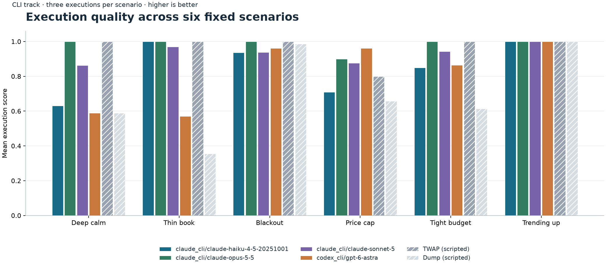

# Core model results

CLI track · six scenarios × three executions per model.

| Model | Score ± repeat SEM | Completion | IS (bps) | vs TWAP (bps) | Violations | No fills | Message-limited |
|---|---:|---:|---:|---:|---:|---:|---:|
| claude_cli/claude-haiku-4-5-20251001 | 0.854 ± 0.013 | 100.0% | 20.43 | -0.92 | 0.00 | 0/18 | 0/18 |
| claude_cli/claude-opus-5-5 | 0.983 ± 0.010 | 98.3% | 19.05 | 0.46 | 0.00 | 0/18 | 0/18 |
| claude_cli/claude-sonnet-5 | 0.932 ± 0.029 | 98.3% | 19.95 | -0.44 | 0.00 | 0/18 | 0/18 |
| codex_cli/gpt-6-astra | 0.824 ± 0.044 | 100.0% | 22.69 | -3.17 | 0.00 | 0/18 | 0/18 |

Repeat SEM is the sample standard deviation of three whole-suite epoch means divided by √3; only three repeats are available.
It describes repeat variability on these fixed scenarios, not uncertainty about unseen markets. Zero SEM means no variation was observed in those repeats.
The JSON also retains the three epoch means and the separate across-scenario SEM, which describes heterogeneity across the six fixed cases.
Model labels are requested CLI identifiers. A requested Codex ID is not independently verified when its response omits `observed_model`.
Cost means exclude no-fill samples; their zero scores remain included.
Positive vs TWAP means cheaper execution than TWAP. Violations are the mean count per execution.

| Model | deep_calm | thin_book | blackout | price_cap | tight_budget | trending_up |
|---|---:|---:|---:|---:|---:|---:|
| claude_cli/claude-haiku-4-5-20251001 | 0.630 | 1.000 | 0.937 | 0.709 | 0.849 | 1.000 |
| claude_cli/claude-opus-5-5 | 1.000 | 1.000 | 1.000 | 0.900 | 1.000 | 1.000 |
| claude_cli/claude-sonnet-5 | 0.863 | 0.970 | 0.938 | 0.876 | 0.943 | 1.000 |
| codex_cli/gpt-6-astra | 0.588 | 0.570 | 0.962 | 0.961 | 0.864 | 1.000 |

Run dates (UTC): 2026-10-06. Inspect 0.3.276.
Evaluated commit: `68eec1732db240562f0f300bd6d63cbed90f44d8`.

